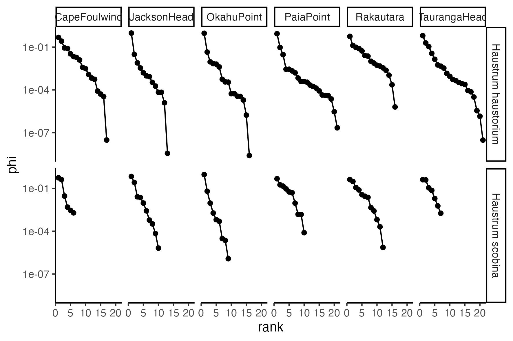

# Adaptive_foraging

This repository is part of my thesis where I will compile data from different studies containing info on prey consumed and available for generalist consumers under field conditions.

---

# Contents

## [Data](Data/)

### [Novak_2013](Data/Novak_2013/)
Data for two marine predatory whelks, _Haustrum haustorium_ and _Haustrum scobina_, from 6 sites around the South Island of New Zealand.

> [Novak (2013) Trophic omnivory across a productivity gradient: intraguild predation theory and the structure and strength of species interactions. _Proceedings of the Royal Society B: Biological Sciences_.](https://royalsocietypublishing.org/doi/10.1098/rspb.2013.1415)

### [Novak_etal_2017](Data/Novak_etal_2017/)
Data for a marine predatory whelk, _Nucella ostrina_, from 10 unmanipulated and 9 manipulated mussel bed "patches" at one site in Oregon, USA.

> [Novak, Wolf, Coblentz, Shepard (2017) Quantifying predator dependence in the functional response of generalist predators. _Ecology Letters_.](
https://onlinelibrary.wiley.com/doi/10.1111/ele.12777)
